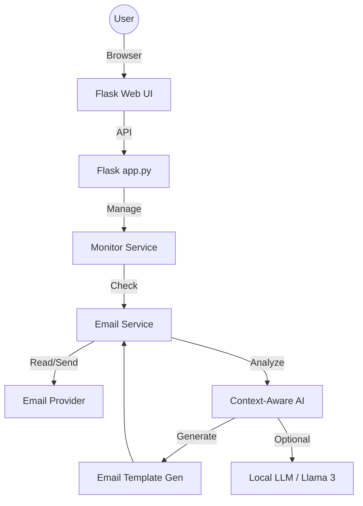

# AI Email Auto-Reply Application 📧🤖

A production-ready AI-powered automatic email reply system with real SMTP/IMAP integration, context-aware response generation, and a modern web interface.

## 🌟 Features

- 🧠 **Context-Aware AI Engine** - Understands email topics (billing, technical, scheduling) and generates custom responses.
- 🦙 **Ollama Integration** - Support for local LLMs like Llama 3 and Mistral for high-quality, human-like replies.
- 📧 **Full Email Integration** - IMAP/SMTP support for Gmail, Outlook, Yahoo, and more.
- ⚡ **Real-time Monitoring** - Automatic background inbox checking with configurable intervals.
- 💾 **Permanent History** - Processed emails and history are persisted locally, surviving server restarts.
- 🛡️ **Thread-Safe Operations** - Robust connection management handling concurrent manual and automatic checks.
- 🎨 **Neobrutalist UI/UX** - Bold, high-contrast dashboard built with **Bootswatch Brite** and Bootstrap 5.
- ⚖️ **Apache License 2.0** - Fully open-source and ready for professional use.

### 📸 Preview

#### Login Page


#### Dashboard


---

## 🚀 Quick Start

### Prerequisites

- Python 3.8 or higher
- An email account with **App Password** enabled:
  - [Gmail App Passwords](https://myaccount.google.com/apppasswords)
  - [Outlook App Passwords](https://support.microsoft.com/en-us/office/how-to-get-and-use-app-passwords-58019d14-42a3-4b0d-90fd-569C5C00039A)
- (Optional) [Ollama](https://ollama.com/) for advanced AI generation.

### Installation

1. **Clone the repository**
   ```bash
   git clone https://github.com/apiwishboon-spec/AI-Email-Auto-Reply-System.git
   cd AI-Email-Auto-Reply-System
   ```

2. **Set up Virtual Environment**
   ```bash
   python3 -m venv venv
   source venv/bin/activate  # On Windows: venv\Scripts\activate
   ```

3. **Install Dependencies**
   ```bash
   pip install -r requirements.txt
   ```

4. **Environment Configuration**
   ```bash
   cp .env.example .env
   # Open .env and set your preferences (e.g., USE_OLLAMA=True)
   ```

---

## 💻 Usage

1. **Launch the Server**
   ```bash
   python app.py
   ```
   *The application will be accessible at `http://localhost:5001`.*

2. **Login**
   Enter your email and the **App Password** you generated.

3. **Start Monitoring**
   Enable **Auto-Reply** from the dashboard. The system will start checking your inbox every 30 seconds (default).

---

## 🏛️ Architecture



---

## 🛠️ Technology Stack

- **Backend**: Python, Flask, Flask-CORS
- **Email Protocol**: IMAP (imaplib) & SMTP (smtplib)
- **AI Core**: Custom AI Processor + Optional Ollama (Requests)
- **Frontend**: Bootstrap 5, Bootswatch Brite (Neobrutalism), Vanilla Javascript
- **Persistence**: Local JSON Storage (Thread-safe)

---

## 🔒 Security & Best Practices

- **App Passwords**: Never use your primary account password.
- **Environment Safety**: The `.env` and `processed_history.json` files are git-ignored to protect your data.
- **Local AI**: Using Ollama keeps your email content entirely on your own machine.
- **Persistence**: Processed email IDs are tracked to prevent double-replies.

---

## 📄 License

This project is licensed under the **Apache License 2.0**. See the [LICENSE](LICENSE) file for details.

---

## 👨‍💻 Developed By

**APIWISH ANUTARAVANICHKUL**
© 2025 All rights reserved.
